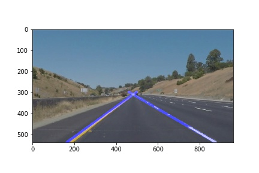

# **Finding Lane Lines on the Road**

---

**Finding Lane Lines on the Road**

The goals / steps of this project are the following:
* Make a pipeline that finds lane lines on the road
* Reflect on your work in a written report

[//]: # (Image References)

[image1]: ./examples/grayscale.jpg "Grayscale"

---

### Reflection

### 1. Describe your pipeline. As part of the description, explain how you modified the draw_lines() function.

My pipeline consisted of 5 steps.
I divided my pipeline into 5 steps.
First, I converted the images to grayscale, then applied a Canny transform, and then applied a Gaussian noise kernel, and then select a region of image to detect lines, and then applied Hough transform, and finally add weights to the original image.

In order to draw a single line on the left and right lanes, I modified the draw_lines() function by

If you'd like to include images to show how the pipeline works, here is how to include an image:

### 2. Identify potential shortcomings with your current pipeline

One potential shortcoming would be what would happen when driving on a curving road.
Since I drew the right and left averaged lines made by a bunch of Hough lines, it doesn't work with curves.

### 3. Suggest possible improvements to your pipeline

A possible improvement would be to change the way to create averaged lines against curves.
